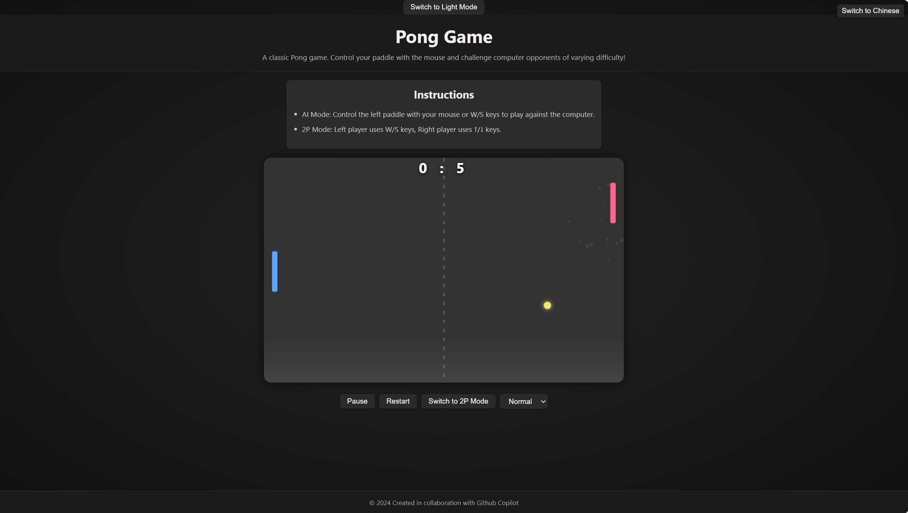

# Pong Game

  <a href="README.md">中文</a> | <a href="README.en.md">English</a>

This is a classic Pong game implemented using HTML, CSS, and JavaScript. It features a simple and intuitive interface with multiple functionalities.

## Screenshot

## File Structure

- `index.html`: The main HTML file that sets up the game canvas and basic page structure.
- `style.css`: Contains the CSS rules for styling the game and the page.
- `pong.js`: The JavaScript file containing the game logic for Pong.

## How to Play

1. Open `index.html` in a web browser.
2. The game starts in **AI Mode** by default:
   - **AI Mode**: Control the left paddle with your mouse or W/S keys to play against the computer.
   - **2P Mode**: Click the "Switch to 2P Mode" button. The left player uses W/S keys, and the right player uses the ↑/↓ keys.
3. The game interface includes the following controls:
   - **Pause/Resume Button**: Pauses or resumes the game.
   - **Restart Button**: Resets the score and ball position.
   - **Mode Toggle Button**: Switches between AI Mode and 2P Mode.
   - **Difficulty Selector (AI Mode only)**: Choose the AI opponent's difficulty level (Easy, Normal, Hard).
   - **Language Switcher Button**: Toggles the interface language between Chinese and English.
4. Try to hit the ball and prevent it from passing your paddle. The first player to reach the target score wins.
5. Game instructions are also displayed directly at the top of the game page.
