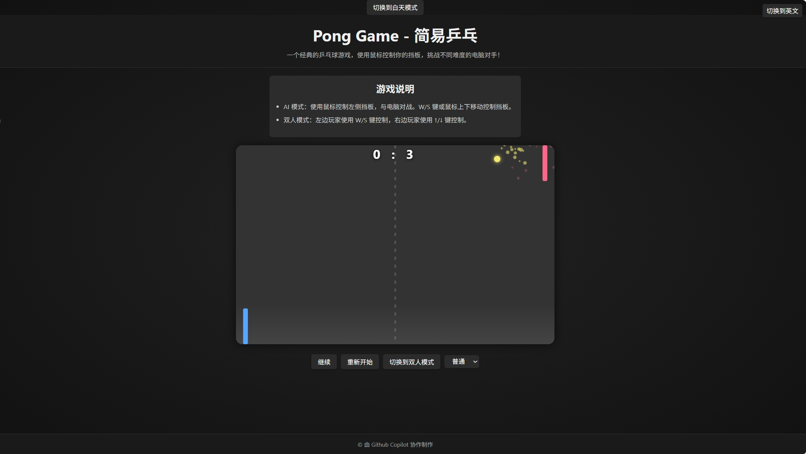

# 乒乓球游戏

  <a href="README.md">中文</a> | <a href="README.en.md">English</a>

这是一个使用 HTML、CSS 和 JavaScript 实现的经典乒乓球游戏，具有简单直观的界面和多种功能。

## 游戏截图

## 文件结构

- `index.html`: 主要的 HTML 文件，用于设置游戏画布和基本页面结构。
- `style.css`: 包含用于设置游戏和页面样式的 CSS 规则。
- `pong.js`: 包含乒乓球游戏逻辑的 JavaScript 文件。

## 如何游玩

1. 在网页浏览器中打开 `index.html`。
2. 游戏默认以 **AI 对战模式** 开始：
   - **AI 模式**：使用鼠标或键盘 W/S 键控制屏幕左侧的球拍，与电脑对战。
   - **双人模式**：点击“切换到双人模式”按钮。左边玩家使用 W/S 键控制，右边玩家使用 ↑/↓ 键控制。
3. 游戏界面包含以下控制：
   - **暂停/继续按钮**：暂停或继续游戏。
   - **重新开始按钮**：重置游戏得分和球的位置。
   - **切换模式按钮**：在 AI 对战和双人对战模式之间切换。
   - **难度选择（仅 AI 模式）**：选择电脑对手的难度等级（简单、普通、困难）。
   - **语言切换按钮**：在中文和英文之间切换界面语言。
4. 尝试击球并防止球越过你的球拍，先得到设定分数的玩家获胜。
5. 游戏玩法说明也直接显示在游戏页面的顶部。
